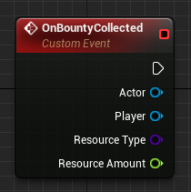
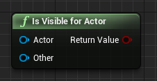
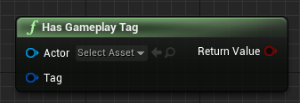
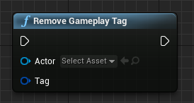
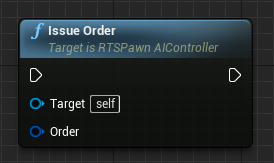
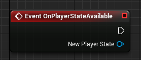
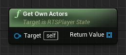

# Manual

## Contents

1. [Setup](#setup)
1. [Game Modes](#game-modes)
1. [Maps](#creating-maps)
1. [Units](#creating-units)
1. [Buildings](#creating-buildings)
1. [Resources](#creating-resource-sources)
1. [User Interface](#creating-the-user-interface)
1. [AI Players](#ai-players)
1. [Scripting](#scripting)
1. [Cheats](#cheats)

## Setup

### Game Framework Setup

_Real-Time Strategy Plugin for Unreal Engine 4_ extends the [game framework](https://docs.unrealengine.com/en-US/Gameplay/Framework/index.html) provided by Unreal Engine with features that are common in real-time strategy games.

For this, we embrace the principle of _composition over inheritance_: Most features are implemented by the means of components to add to your actors, to allow for the most flexibility on your side when building your game, especially when it comes to combining the plugin with other third-party software.

Some things have been carefully added to the existing game framework however, as designed by Epic, and require a few steps to set up.

The plugin also ships with a few assets that are designed to get you started, e.g. with unit AI, but feel free to modify or replace them as you see fit.

Make sure _View Plugin Content_ is enabled in your view options.

1. Create a player controller deriving from `RTSPlayerController`.
1. Create a player state deriving from `RTSPlayerState`.
1. Create a game state deriving from `RTSGameState`.
1. Create a HUD deriving from `RTSHUD`.
1. Create a game mode deriving from `RTSGameMode`.
1. Use your player controller, player state, game state, and HUD in your game mode.
1. Create an AI controller deriving from `RTSPawnAIController`.
1. Set the _Pawn Behavior Tree Asset_ of the new pawn AI controller to `BT_RTSPawnBehaviorTree`.
1. Set the _Pawn Blackboard Asset_ of the new pawn AI controller to `BB_RTSPawnBlackboard`.
1. Set the _Acquisition Object Types_ of the new pawn AI controller to `WorldDynamic` (or whichever _Object Type_ you're going to use in the collision settings of your units).
1. Create a player start deriving from `RTSPlayerStart`.
1. Create one or more resource types deriving from `RTSResourceType`, setting their names and icons to use in your UI.
1. Add the resource types to the `PlayerResourcesComponent` of your player controller.

### Camera Setup

Usually, players control a single [pawn](https://docs.unrealengine.com/en-US/Gameplay/Framework/Pawn/index.html) in Unreal Engine. However, in the case of real-time strategy games, players control many units from a camera perspective far out. Thus, the plugin works best when using a simple pawn with a normal camera whose location reflects what the player wants to see right now. Individual units are not directly possessed by the player controllers, but just "owned" by them.

#### Creating The Camera

1. Create a pawn blueprint.
1. Add a `Camera` component.
1. Set the _Location_ of the `Camera` component as desired (e.g. X = 0, Y = 0, Z = 1500).
1. Set the _Rotation_ of the `Camera` component as desired (e.g. X = 0, Y = -75, Z = 0).
1. Use the pawn as _Default Pawn Class_ in your game mode.

#### Setting Up Camera Movement

1. Bind the axis `MoveCameraLeftRight` (e.g. to Left and Right keys).
1. Bind the axis `MoveCameraUpDown` (e.g. to Up and Down keys).
1. Bind the axis `ZoomCamera` (e.g. to the mouse wheel axis).
1. At your `RTSPlayerController`, set the _Camera Speed_ (e.g. to 1000).
1. At your `RTSPlayerController`, set the _Camera Scroll Threshold_ (e.g. to 20).
1. At your `RTSPlayerController`, set _Camera Zoom Speed_, _Min Camera Distance_ and _Max Camera Distance_ as desired.
1. At your `RTSPlayerController`, set _Double Group Selection Time_ to the number of seconds the player has for rapidly selecting the same control group to center the camera on it.

### Input Setup

Many default [input](https://docs.unrealengine.com/en-US/Gameplay/Input/index.html) actions for real-time strategy games are already provided by the plugin. Given that you use an RTSPlayerController in your game mode, you can bind the following actions which should speak for themselves. Clearly, all of these bindings are optional.

At _Edit > Project Settings > Engine > Input_ ...

#### Selection

1. Bind the action `Select` (e.g. to left mouse button).
1. Bind the actions `SaveControlGroup0` to `SaveControlGroup9` (e.g. to CTRL+0 to CTRL+9).
1. Bind the actions `LoadControlGroup0` to `LoadControlGroup9` (e.g. to 0 to 9).
1. Bind the action `AddSelection` (e.g. to Left Shift).
1. Bind the action `ToggleSelection` (e.g. to Left Ctrl).
1. Bind the action `SelectNextSubgroup` (e.g. to Tab).
1. Bind the action `SelectPreviousSubgroup` (e.g. Shift + Tab).

#### Camera

1. Bind the actions `SaveCameraLocation0` to `SaveCameraLocation4` (e.g. to CTRL+F5 to CTRL+F9).
1. Bind the actions `LoadCameraLocation0` to `LoadCameraLocation9` (e.g. to F5 to F9).

#### Orders

1. Bind the action `IssueOrder` (e.g. to the right mouse button). This will enable typical smart orders, such as moving when right-clicking ground, and attacking when right-clicking enemies.
1. Bind the action `IssueStopOrder` (e.g. to the S key).

#### Health Bars

1. Bind the action `ShowHealthBars` (e.g. to the LeftAlt key).

### Production

1. Bind the action `CancelProduction` (e.g. to Escape).
1. Bind the action `ShowProductionProgressBars` (e.g. to the LeftAlt key).

#### Construction

1. Bind the action `ConfirmBuildingPlacement` (e.g. to Left Mouse Button).
1. Bind the action `CancelBuildingPlacement` (e.g. to Right Mouse Button).
1. Bind the action `CancelConstruction` (e.g. to Escape).
1. Bind the action `ShowConstructionProgressBars` (e.g. to the LeftAlt key).

### Gameplay Tags

The plugin makes use of [gameplay tags](https://docs.unrealengine.com/en-US/Gameplay/Tags/index.html) for enabling condition-based gameplay (such as whether a unit can be attacked or not).

At _Edit > Project Settings > Project > Gameplay Tags_, add `DT_RTSGameplayTags` to the _Gameplay Tag Table List_.

## Game Modes

Clearly, even for real-time strategy games, you may want to define multiple game modes (such as classic Skirmish or story-based campaigns). Thus, we won't restrict you too much here, but just want to provide a few basic things that you might find useful.

### Initialization

1. Set the _Initial Actors_ and their locations for your game mode. This will spawn initial units for each player at their player start as soon as the game starts.

### Teams

1. Set _Num Teams_ to the number of teams your game mode supports.

### Game Over

1. Optionally, set the _Defeat Condition Actor Classes_ for your `RTSGameMode`. This will check whether any actors of the specified types exist for a player whenever he or she loses a unit. If no actor of the specified type remains, the player is defeated.

_In that case, the game mode will raise the OnPlayerDefeated event to be overridden in subclasses (either blueprint or C++). Note that it is up to you to define how defeated players should be handled, and if/when the game is over, e.g. whether you've making a 1v1, FFA or team game._

## Creating Maps

For the plugin, you'll design and create your maps the same way you're used to when using Unreal Engine, for the most part. This section serves as a short checklist for you, and highlights some setup that is supposed to make it easier for you to get started. Some steps are mandatory for some features of the plugin to work, however, such as vision.

### Game Mode & Geometry

1. Use your game mode in the world settings.
1. Create your level geometry and lighting as usual.

### Camera

1. Add an `RTSCameraBoundsVolume` to the map.
1. Use the _Brush Settings_ to adjust the camera bounds as desired.

### Navigation

1. Add a `NavMeshBoundsVolume` to the map.
1. Use the _Brush Settings_ to adjust have the nav mesh bounds encompass your whole level.
1. Build navigation. You may press P to review your results in the viewport.

### Player Starts

1. Add `RTSPlayerStart`s to the map.
1. Set the _Team Index_ for each player start.

### Minimap

1. Add an `RTSMinimapVolume` to the very center of your map.
1. Set its brush size to match the extents of your playable map.
1. Set the _Minimap Image_ to a nice top-down screenshot of your map.

### Fog Of War

1. Add an `RTSVisionVolume` to the very center of your map, encompassing the whole valid visible map area.
1. Set the _Size In Tiles_ of the vision volume to match your minimap background images (e.g. 256).
1. Set the _Tile Height_ of the vision volume to the height of a single height level of your map, in cm (e.g. 250).
1. Set the _Height Level Trace Channel_ if you want special geometry to affect your height levels, only.
1. Add a `PostProcessVolume` to your map, and check _Infinite Extent (Unbound)_.
1. Add an `RTSFogOfWarActor` to your map.
1. Set the _Fog Of War Volume_ reference to the post process volume created before.
1. Set the _Fog Of War Material_ of the actor (e.g. to the `M_RTSFogOfWar` material shipped with the plugin).

### Pre-Placed Units

1. Add any actors that should initially on the battlefield.
1. For each of these actors, at the `RTSOwnerComponent`, set the _Initial Owner Player Index_ to specify which player should own them.
1. When pre-placing buildings, at the `RTSConstructionSiteComponent`, set their _State_ to _Finished_ if they should be ready from the beginning.

## Creating Units

As mentioned before, most features of the plugin are implemented by the means of components to add to your actors. Thus, for adding new units (or buildings), you'll usually create a pawn or character, and add various components, depending on the capabitilies you want the unit to have. This approach enables you to combine features just as you like, for instance having buildings that can attack or units that resources can be returned to.

### Appearance

1. Create a new pawn or character blueprint.
1. Check the _Replicates_ flag.
1. Add a static or skeletal mesh and setup its location, rotation and scale as usual.
1. Setup collision (e.g. Capsule Collision) as usual. You may want to disable the collision of your mesh and rely on its capsule instead.
1. Setup your animations. (If you're new to the Unreal animation system, we can readily recommend the tutorial at https://docs.unrealengine.com/latest/INT/Programming/Tutorials/FirstPersonShooter/4/index.html)
1. Add an `RTSNameComponent` and set its localized name if you want to show it in any kind of ingame UI.
1. Add an `RTSDescriptionComponent` and set its localized text if you want to show it in any kind of ingame UI.
1. Add an `RTSPortraitComponent` and set its portrait if you want to show it in any kind of ingame UI.
1. Add an `RTSSelectableComponent`, and set its selection circle material (e.g. to `M_RTSSelectionCircle`) and selection sound.
1. If the selection order of your actors matters (e.g. for grouping in your UI), set the _Selection Priority_ as well. Untick _Receives Decals_ on the static or skeletal mesh to prevent adjacent decals rendering on the unit when in close proximity to other selected units.
1. In case you got special visual effects for highlighting hovered actors, you can listen for the `OnHovered` and `OnUnhovered` events of the component.
1. Add an `RTSOwnerComponent`. This will be used to store (and replicate) the owner of the unit for all players (e.g. for showing team colors).
1. Add your `RTSHoveredActorWidgetComponent` (see [User Interface](UserInterface.md)).

### Movement

1. Add a movement component (e.g. `FloatingPawnMovement` or `CharacterMovement`) and set up its speed properties as usual. The plugin also ships with a `RTSPawnMovementComponent` that basically just adds rotation updates to the built-in `FloatingPawnMovement`.

### Vision

1. Add the `RTSVision` component to your units and set their _Sight Radius_ (e.g. 1000).
1. If your actor should be able to ignore height levels for vision (e.g. watchtowers), check _Ignore Height Levels_.
1. Add a `RTSVisible`component to your actor. That component will manage vibility of that actor, in case multiple effects want to show/hide it (e.g. fog of war, containers).

### Combat

#### AI

As mentioned before, units are not directly possessed by player controllers in the plugin. Instead, every unit is possessed by an AIController that will carry out orders issued by the players.

1. Set the pawn AI controller class to your `RTSPawnAIController`.
1. Ensure _Pawn > Auto Possess AI_ is set to _Placed in World or Spawned_.

#### Health & Damage

1. Add the `RTSGameplayTagsComponent` and add the `Status.Permanent.CanBeAttacked` tag to the `RTSGameplayTagsComponent` to any actors that can be attacked.
1. Set the _Maximum Health_ of the `RTSHealthComponent`.
1. In case your actor should regenerate health, check _Regenerate Health_ and set the _Health Regeneration Rate_.
1. If you want to play animations or visual effects when the actor dies, set _Actor Death Type_ to _Stop Gameplay_. In that case, you're responsible of destroying the actor yourself as soon as all of your visual clues have finished playing.
1. Set the _Death Sound_ to the sound cue to play when the actor is killed.
1. Add your `RTSHealthBarWidgetComponent` (see [User Interface](UserInterface.md)).
1. Add the `RTSAttackComponent` to any actors than can attack.
1. Add an attack to the `RTSAttackComponent` of these actors, setting its _Cooldown, Damage, Range, Acquisition Radius_ and _Chase Radius_.

_Setting the Damage Type is optional._

#### Projectiles

If you don't specify a projectile, the damage will be applied immediately. In order to setup a projectile for the unit:

1. Create an actor deriving from `RTSProjectile`.
1. Add a static mesh and any visual effects.
1. At the `ProjectileMovement` component, set its _Initial Speed_ (e.g. to 1000).
1. If you want your projectile to use a ballistic trajectory, check _Ballistic Trajectory_ at the projectile and set the _Ballistic Trajectory Factor_ as you like.
1. For dealing area of effect damage, check _Apply Area Of Effect_ and set your area of effect radius and collision filters.
1. Set the _Fired Sound_ and _Impact Sound_ to the sound cues to play when the projectile is fired and detonated, respectively.
1. At the `RTSAttackComponent`, reference the new projectile in your attack.

### Production Costs

1. Add the `RTSProductionCostComponent` to everything you want to be produced.
1. Set the _Production Time_ for these products.
1. Set the _Resources_ to any resources required for production.
1. Set the _Production Cost Type_ to to _Pay Immediately_ if all costs should be paid in full when starting production, or to _Pay Over Time_ for continuously paying costs (similar to Command & Conquer).
1. Set the _Refund Factor_ to the factor to multiply refunded resources with after cancelation.
1. Set the _Finished Sound_ to the sound cue to play when the actor spaws after being produced.
1. Add the `RTSRequirementsComponent` if the actor should have any requirements, and set the _Required Actors_.

### Construction

1. Add an `RTSBuilderComponent` to any actors you want to be able to construct buildings.
1. Set the _Constructible Building Classes_ for these builders.
1. Check _Enter Construction Site_ if you want the builder to be unavailable while building (similar to Orcs in WarCraft). In that case, add a `RTSContainableComponent` as well.

### Gathering

1. Add an `RTSGathererComponent` to any actor that should be able to gather resources.
1. Add any resource type the gatherer should be able to gather to _Gathered Resources_.
    1. Gathering works similar to attacks, with "damage" and "cooldown". Set _Amount Per Gathering_ to the value to add to the gatherers inventory each time the cooldown is finished.
    1. Set the _Cooldown_ to the time between two gatherings.
    1. Set the _Capacity_ to the amount of resources the gatherer can carry before returning to a resource drain.
    1. Check _Needs Return To Drain_ if the gatherer needs to move to another actor for returning resources (e.g. Age of Empires). Uncheck if they should return all gathered resources immediately when hitting the capacity limit (e.g. Undead in WarCraft).
    1. Set _Range_ as desired.
1. Add all _Resource Source Actor Classes_ the gatherer may gather from (e.g. Undead in Warcraft need Haunted Gold Mine).
1. Set the _Resource Sweep Radius_ to the radius in which the gatherer should look for similar resources if their current source is depleted.

### Bounties

1. Add an `RTSBountyComponent` to any actors you want to grant bounties to killing players.
1. Set the _Bounty_ for these actors.

### Multiplayer

1. If you're working on an online game, check _Always Relevant_ for your actor.

## Creating Buildings

From the perspective of the plugin, buildings are just units with a few additional components. There's no special class for buildings; their setup has just been moved to this manual section because that many people would explicitly look for that. In fact, you can mix and match the setup outlined in this section with all of the other sections. This allows you to create truly deep gameplay, such as units that serve as resource sources, or produce other units.

### Construction

1. See [Creating Units](Units.md) (Appearance, Health & Damage, Projectiles).
1. Add an `RTSConstructionSiteComponent` and set the _Construction Time_.
1. Set the _Construction Costs_ to any resources required for construction.
1. Set the _Construction Cost Type_ to to _Pay Immediately_ if all costs should be paid in full when starting construction, or to _Pay Over Time_ for continuously paying costs (similar to Command & Conquer).
1. Set the _Refund Factor_ to the factor to multiply refunded resources with after cancelation.
1. Set the _Consumes Builders_ flag if builders working at the construction site should be destroyed when finished (similar to Zerg in StarCraft).
1. Set _Max Assigned Builders_ if you want to require a builder to work at the construction site to make progress, and/or to allow multi-building (similar to Age of Empires).
1. Set the _Progress Made Automatically_ and _Progress Made Per Builder_ factors.
1. Set _Initial Health Percentage_ to a value between 0 and 1 to specify how much health the construction site should start with.
1. Set the _Start Immediately_ flag unless you want to trigger construction start from script.
1. If you want to use grid-based building placement, set the _Grid Width and Height_.
1. Set the _Finished Sound_ to the sound cue to play when the construction is finished.
1. Add an `RTSContainerComponent` if you want builders to enter the building site while building. Its capacity value will be automatically set at runtime to reflect _Max Assigned Builders_ of the construction site.
1. Add your `RTSConstructionProgressBarWidgetComponent` (see [User Interface](UserInterface.md)).

### Production

1. Add an `RTSProductionComponent` to any actors you want to be able to produce units or research technology.
1. Add everything you want to produce or research to the _Available Products_ for these factories.
1. Set the _Queue Count_, specifying how many products can be produced in parallel.
1. Set the _Capacity Per Queue_, specifying how many products can be produced one after another.
1. Add your `RTSProductionProgressBarWidgetComponent` (see [User Interface](UserInterface.md)).

_Note that, technically, producing units does not differ from researching technology. You can create actor blueprints without physical representation for each technology to research, and add them as products. Then, you can check whether any player owns an actor of that technology for checking a tech tree._

### Resource Drain

1. Add an `RTSResourceDrainComponent` for each type of building gatherers may return resources to.
1. Set the resource types to all resources accepted by the drain.

### Defense

1. If your building has an `RTSAttackComponent`, check _Preview Attack Range_ if you want the attack range of your building to be previewed while placing the building.

### Vision

1. At the `RTSVisible`component of your building, check _Don't Hide After Seen_ if you want your building to stay visible even through for of war.

### Projectile Impacts

1. While your building is under attack, you might want to prevent every single projectile hitting the exact same location. You can add a `RTSProjectileTargetComponent` to your actor, and specify the _Target Sockets_ to have projectile fly towards. These sockets have to be added to your static mesh using the built-in Unreal socket manager.
2. If your building has multiple mesh components, add a _component tag_ to the desired mesh component and specify the same tag at your `RTSProjectileTargetComponent`.

## Creating Resource Sources

In case you missed that step earlier, make your to set up your resource types as explained in [Setup](Setup.md). Then, create resource sources as follows:

1. See [Creating Units](Units.md) (Appearance only; can be a standard actor).
1. Add an `RTSResourceSourceComponent`.
1. Set the resource type and maximum and current resources of the source.
1. Set the gathering factor for increasing the yield of any gatherers (e.g. golden minerals in StarCraft).
1. If you want gatherers to enter the resource source (e.g. Refinery in StarCraft), check _Gatherer Must Enter_, set the _Gatherer Capacity_, and add an `RTSContainerComponent`. In that case, add a `RTSContainableComponent` to all gatherers as well.

## Creating The User Interface

Usually, you'll want to create a very individual user interface for your own game. However, some things are very common to real-time strategy games, such as health bars or minimaps, and we want to provide you a small head start at least, mostly by the means of events you can implement. As always, feel free to create your own UI widgets as you see fit - you should be able to apply them easily with the plugin.

### Selection Frames

In your HUD, implement the `DrawSelectionFrame` and `HideSelectionFrame` events as desired.

Example:

1. Create a widget for drawing the selection frame.

2. Add your widget to any kind of user interface your player controller knows about.
3. In that user interface, provide a function for showing the selection frame.

4. In the user interface, provide a function for hiding the selection frame.

5. In your HUD, forward the `DrawSelectionFrame` event to your UI.

6. In the HUD, forward the `HideSelectionFrame` event to your UI.

### Selected Unit Status

1. Create a new widget blueprint.
1. Create the widget where appropriate (e.g. `BeginPlay` of your player controller) and add it to your viewport.
1. Listen to the `OnSelectionChanged` event broadcasted by the `RTSPlayerController` and update your UI.

### Health Bars

1. In your HUD, set _Always Show Health Bars, Show Hover Health Bars, Show Selection Health Bars_ and _Show Hotkey Health Bars_ as desired.
2. Create a widget for drawing the health bar.

_You might want to make sure that the visibility of the widget is set to Hit Test Invisible. Otherwise, it will block mouse input from your player._

3. Create a component deriving from `RTSHealthBarWidgetComponent`, and set its _Widget Class_ to your health bar widget.
4. Forward the `UpdateHealthBar` event to your health bar widget.

5. Forward the `UpdatePositionAndSize` event to your health bar widget.

### Hovered Actors

1. Create a widget for drawing name plates (or whatever other information you'd like to display for hovered actors).

_You might want to make sure that the visibility of the widget is set to Hit Test Invisible. Otherwise, it will block mouse input from your player._

2. Create a component deriving from `RTSHoveredActorWidgetComponent`, and set its Widget Class to your new widget widget.
3. Forward the `UpdateData` event to your widget.

4. Forward the `UpdatePositionAndSize` event to your widget.

### Building Cursors

1. Create an actor deriving from `RTSBuildingCursor` (or use the `BP_RTSBuildingCursor` shipped with the plugin).
1. If you want to use grid-based building placement, set the _Grid Cell Size_ of your building cursor, and set up its collision and navigation check settings as desired.
1. In your player controller, set the building cursor reference.

_Note: When having your building cursor query navigation, you need to enable Allow Client Side Navigation in your project settings for this to work in multiplayer._

### Range Indicators

1. Create an actor deriving from `RTSRangeIndicator` (or use the `BP_RTSRangeIndicator` shipped with the plugin).
1. At your building cursor, set the range indicator reference.

### Production UI

1. Use `GetAvailableProducts` of a selected production actor to create buttons for your production options (e.g. whenever the player controller raises OnSelectionChanged).
1. Call `IssueProductionOrder` of your player controller whenever one of these buttons is clicked.

### Production Progress Bars

1. In your HUD, set _Always Show Production Progress Bars, Show Hover Production Progress Bars, Show Selection Production Progress Bars_ and _Show Hotkey Production Progress Bars_ as desired.
2. Create a widget for drawing the production progress bar.

_See the [Health Bars](#health-bars) section for an example._

3. Create a component deriving from `RTSProductionProgressBarWidgetComponent`, and set its _Widget Class_ to your progress bar widget.
4. Forward the `UpdateProductionProgressBar` event to your progress bar widget.
5. Forward the `UpdatePositionAndSize` event to your progress bar widget.

### Construction UI

1. Use `GetConstructibleBuildingClasses` of a selected builder to create buttons for your construction options (e.g. whenever the player controller raises `OnSelectionChanged`).
1. Call `BeginBuildingPlacement` of your player controller whenever one of these buttons is clicked.

### Construction Progress Bars

1. In your HUD, set _Always Show Construction Progress Bars, Show Hover Construction Progress Bars, Show Selection Construction Progress Bars_ and _Show Hotkey Construction Progress Bars_ as desired.
2. Create a widget for drawing the construction progress bar.

_See the [Health Bars](#health-bars) section for an example._

3. Create a component deriving from `RTSConstructionProgressBarWidgetComponent`, and set its _Widget Class_ to your progress bar widget.
4. Forward the `UpdateConstrutionProgressBar` event to your progress bar widget.
5. Forward the `UpdatePositionAndSize` event to your progress bar widget.

### Resources UI

1. Create a widget for showing your current resources.
1. Handle the `OnResourcesChanged` event raised by the `PlayerResourcesComponent` attached to your player controller to update your UI.

### Minimap

1. Add the `WBP_RTSMinimapWidget` to your UI, with a size matching your minimap volume images (e.g. 256 x 256).
1. Set the _Draw Background, Draw Units With Team Colors, Draw Vision_ and _Draw View Frustum_ flags as desired.
1. If you checked _Draw Units With Team Colors_, set the _Own Units Brush, Enemy Units Brush_ and _Neutral Units Brush_ as desired.
1. If you want damaged units to blink on the minimap, set _Damaged Units Blink Brush_ and _Damaged Unit Blink Time Seconds_ as desired.

### Floating Combat Texts

1. In your HUD, enable _Show Floating Combat Texts_.
2. Set _Floating Combat Text Speed_ and _Fade Out Floating Combat Texts_ as desired.
3. Add a `RTSFloatingCombatTextComponent` to any actor that should be able to display texts above them.
4. Create an actor component for adding the actual floating combat texts.

5. Add your actor component to all actors that should be able to add floating combat texts.
6. In your HUD, handle the `DrawFloatingCombatText` event.

## AI Players

The plugin provides basic support for AI players as well. Currently, this doesn't go beyond fulfilling basic build orders, so you'll probably want to extend that, e.g. by determining when to attack other players, and where. At least, this should get you started:

1. Create an AI controller deriving from `RTSPlayerAIController`.
1. Set the _Player Behavior Tree Asset_ of your new player AI controller to `BT_RTSPlayerBehaviorTree` (or create your own one).
1. Set the _Player Blackboard Asset_ of your new player AI controller to `BB_RTSPlayerBlackboard` (or create your own one).
1. Set up the _Build Order_ of your new player AI controller. The AI will produce the specified actors in order, automatically skipping actors that are already available and replacing those that have been destroyed.
1. Set up the _Primary Resource Type_ of your new player AI controller. The AI will try and prevent blocking paths between its main building and resource sources of that type.
1. Add your resource types to the `PlayerResourcesComponent` of your player AI controller.
1. Check _Gives Bounty_ if killing actors owned by the AI should yield bounties (e.g. for neutral players).
1. Use your player AI controller in your game mode.
1. At your game mode, set _Num AI Players_ to the number of AI players you want to spawn.

## Scripting

Occasionally, you want to create additional gameplay (especially when creating a story campaign). This section highlights additional functions you can call from blueprints, as well as events you may handle.

Feel free to explore the plugin yourself by looking at what other functions and events each component provides, and open an issue if you're missing something.

Also note that much gameplay of the plugin relies on [Gameplay Tags](https://docs.unrealengine.com/en-US/Gameplay/Tags/index.html) as defined by `Content\Data\DT_RTSGameplayTags.uasset`. This enables you to create unique gameplay and abilities by applying/removing these tags to/from the `URTSGameplayTagsComponent` of your actors. Initially, many of the plugin components apply matching gameplay tags (e.g. `Status.Permanent.CanAttack` from `RTSAttackComponent`). When creating your own actor components, you can derive from `RTSActorComponent` to provide your own _Initial Gameplay Tags_ as well. The plugin also provides an own [Gameplay Debugger](https://docs.unrealengine.com/en-US/Gameplay/Tools/GameplayDebugger/index.html) category for checking the gameplay tags of selected actors.

### RTSBountyComponent
#### Events

| Event | Description |
| --- | --- |
|  | Event when the bounty was collected. |

### RTSContainerComponent
#### Functions

| Node | Description |
| --- | --- |
|  | Adds the specified actor to this container. |
|  | Removes the specified actor from this container. |

### RTSConstructionSiteComponent
#### Events

| Event | Description |
| --- | --- |
|  | Event when the construction timer has expired. |

### RTSGameMode
#### Functions

| Node | Description |
| --- | --- |
|  | Sets the specified player as the owner of the passed actor. |

### RTSGameplayLibrary
#### Functions

| Node | Description |
| --- | --- |
|  | Checks whether Other is visible for Actor. |

### RTSGameplayTagLibrary
#### Functions

| Node | Description |
| --- | --- |
|  | Applies the passed gameplay tag to the specified actor. |
|  | Gets the current set of gameplay tags of the specified actor. |
|  | Checks whether the specified actor currently has the passed gameplay tag applied. |
|  | Removes the passed gameplay tag from the specified actor. |

### RTSHealthComponent
#### Events

| Event | Description |
| --- | --- |
|  | Event when the current health of the actor has changed. |
|  | Event when the actor has been killed. |

### RTSPawnAIController
#### Functions

| Node | Description |
| --- | --- |
|  | Makes the pawn carry out the specified order. |
|  | Makes the pawn attack the specified target. |
|  |  Makes the pawn construct the specified building at the passed location. |
|  | Makes the pawn gather resources from the specified source. |
|  | Makes the pawn move towards the specified location. |
|  | Makes the pawn stop all actions immediately. |

#### Events

| Event | Description |
| --- | --- |
|  | Event when the pawn has received a new order. |

### RTSPlayerController
#### Events

| Event | Description |
| --- | --- |
|  | Event when the player state has been set up or replicated for this player. |

### RTSPlayerResourcesComponent
#### Functions

| Node | Description |
| --- | --- |
|  | Adds the specified resources to the stock of this player. |

#### Events

| Event | Description |
| --- | --- |
|  | Event when the current resource stock amount for the player has changed. |

### RTSPlayerController
#### Functions

| Node | Description |
| --- | --- |
|  | Gets the list of actors currently owned by this player. |

### RTSProductionComponent
#### Events

| Event | Description |
| --- | --- |
|  | Event when the production timer has expired. |

## Cheats

The plugin comes with a small set of built-in cheats you can use. Feel free to create your own cheat manager and add additional cheats.

1. Create a cheat manager deriving from `RTSCheatManager`.
1. Set the _Resource Types_ of your cheat manager.
1. At your `RTSPlayerController`, set the _Cheat Manager_ to your cheat manager.
1. At _Edit > Project Settings > Engine > Input_, set and remember your _Console Keys_.

This will unlock the following built-in cheats to use in your console:

| Cheat | Description |
| --- | --- |
| Boost | Increases construction and production speed. |
| Damage | Increase damage of all own units. |
| God | Invulnerability cheat. |
| NoFog | Toggles fog of war on/off. |
| Money | Adds resources. |
| Victory | Defeat all other players. |
| Weak | Decreases damage of all own units. |
