## Scripting

Occasionally, you want to create additional gameplay (especially when creating a story campaign). This section highlights additional functions you can call from blueprints, as well as events you may handle.

Feel free to explore the plugin yourself by looking at what other functions and events each component provides, and open an issue if you're missing something.

### RTSContainerComponent
#### Functions

| Node | Description |
| --- | --- |
| 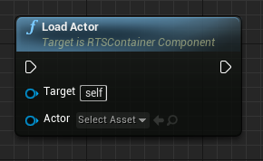 | Adds the specified actor to this container. |
| 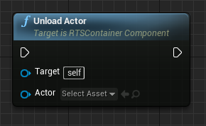 | Removes the specified actor from this container. |

### RTSConstructionSiteComponent
#### Events

| Event | Description |
| --- | --- |
| 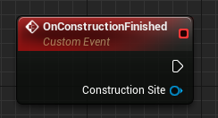 | Event when the construction timer has expired. |

### RTSGameMode
#### Functions

| Node | Description |
| --- | --- |
| 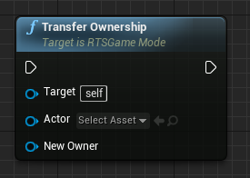 | Sets the specified player as the owner of the passed actor. |

### RTSHealthComponent
#### Events

| Event | Description |
| --- | --- |
| 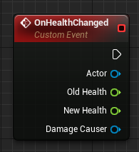 | Event when the current health of the actor has changed. |
| 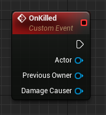 | Event when the actor has been killed. |

### RTSPawnAIController
#### Functions

| Node | Description |
| --- | --- |
| 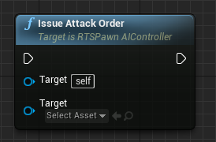 | Makes the pawn attack the specified target. |
| 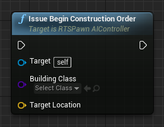 |  Makes the pawn construct the specified building at the passed location. |
| 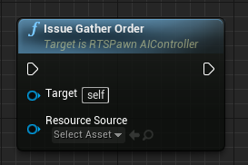 | Makes the pawn gather resources from the specified source. |
| 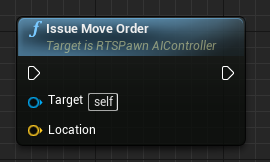 | Makes the pawn move towards the specified location. |
| 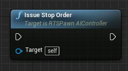 | Makes the pawn stop all actions immediately. |

#### Events

| Event | Description |
| --- | --- |
| 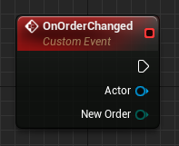 | Event when the pawn has received a new order. |

### RTSPlayerResourcesComponent
#### Functions

| Node | Description |
| --- | --- |
| 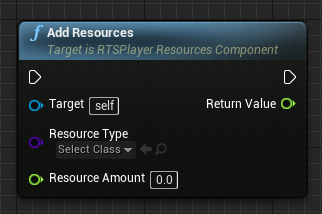 | Adds the specified resources to the stock of this player. |

#### Events

| Event | Description |
| --- | --- |
| 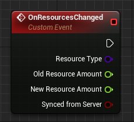 | Event when the current resource stock amount for the player has changed. |

### RTSProductionComponent
#### Events

| Event | Description |
| --- | --- |
| 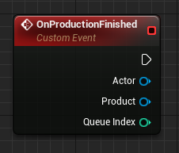 | Event when the production timer has expired. |
