## Creating The User Interface

Usually, you'll want to create a very individual user interface for your own game. However, some things are very common to real-time strategy games, such as health bars or minimaps, and we want to provide you a small head start at least, mostly by the means of events you can implement. As always, feel free to create your own UI widgets as you see fit - you should be able to apply them easily with the plugin.

### Selection Frames

In your HUD, implement the `DrawSelectionFrame` and `HideSelectionFrame` events as desired.

Example:

1. Create a widget for drawing the selection frame.

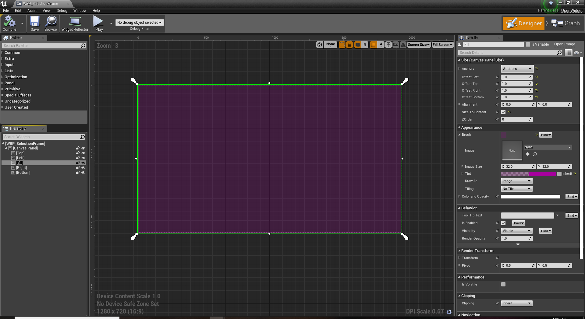

2. Add your widget to any kind of user interface your player controller knows about.
3. In that user interface, provide a function for showing the selection frame.

4. In the user interface, provide a function for hiding the selection frame.

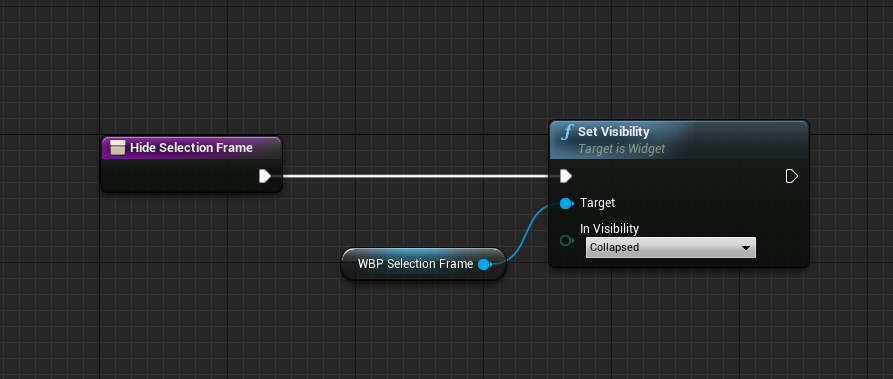

5. In your HUD, forward the `DrawSelectionFrame` event to your UI.

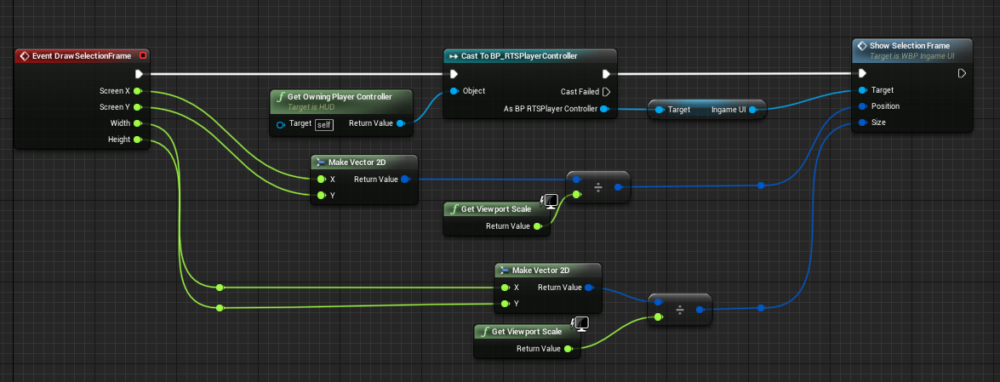

6. In the HUD, forward the `HideSelectionFrame` event to your UI.

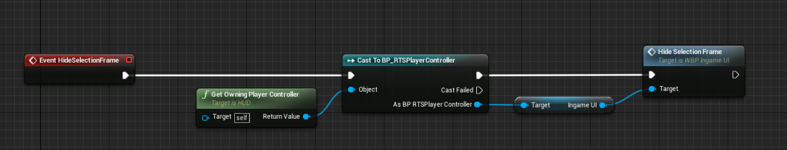

### Selected Unit Status

1. Create a new widget blueprint.
1. Create the widget where appropriate (e.g. `BeginPlay` of your player controller) and add it to your viewport.
1. Listen to the `OnSelectionChanged` event broadcasted by the `RTSPlayerController` and update your UI.

### Health Bars

1. In your HUD, set _Always Show Health Bars, Show Hover Health Bars, Show Selection Health Bars_ and _Show Hotkey Health Bars_ as desired.
2. Create a widget for drawing the health bar.

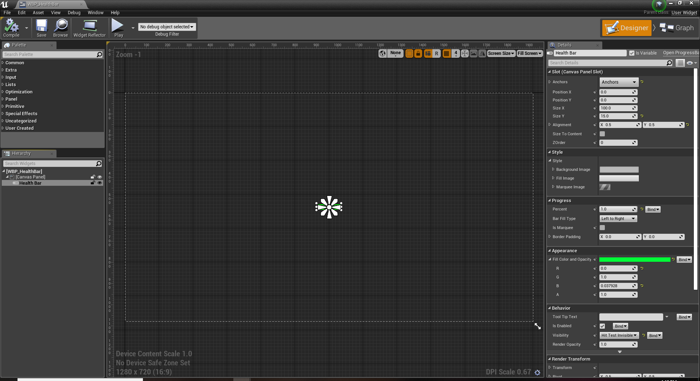

_You might want to make sure that the visibility of the widget is set to Hit Test Invisible. Otherwise, it will block mouse input from your player._

3. Create a component deriving from `RTSHealthBarWidgetComponent`, and set its _Widget Class_ to your health bar widget.
4. Forward the `UpdateHealthBar` event to your health bar widget.

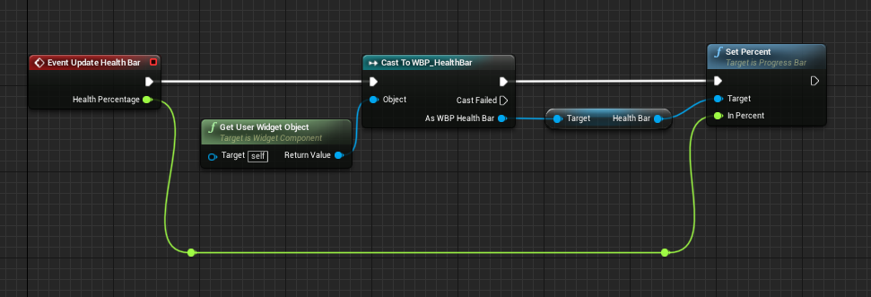

5. Forward the `UpdatePositionAndSize` event to your health bar widget.

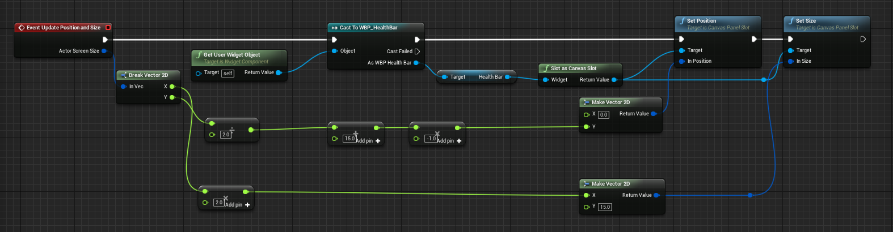

### Hovered Actors

1. Create a widget for drawing name plates (or whatever other information you'd like to display for hovered actors).

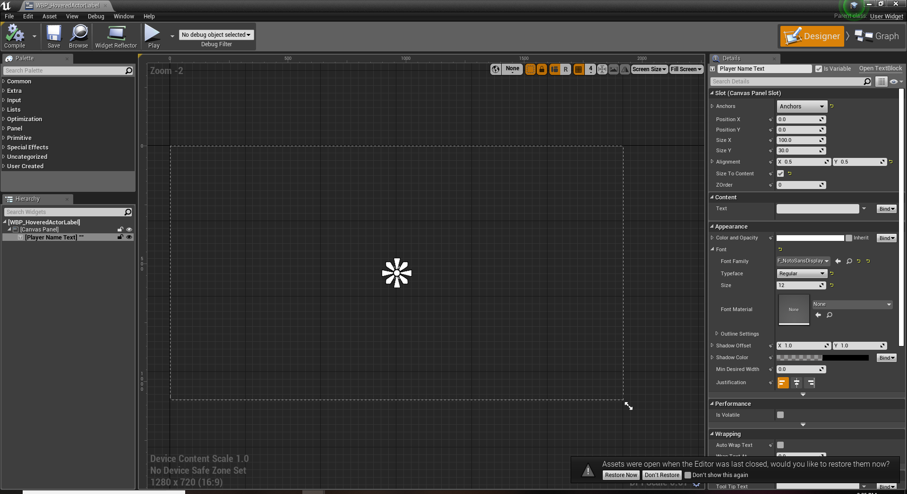

_You might want to make sure that the visibility of the widget is set to Hit Test Invisible. Otherwise, it will block mouse input from your player._

2. Create a component deriving from `RTSHoveredActorWidgetComponent`, and set its Widget Class to your new widget widget.
3. Forward the `UpdateData` event to your widget.

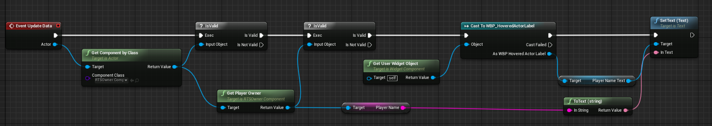

4. Forward the `UpdatePositionAndSize` event to your widget.

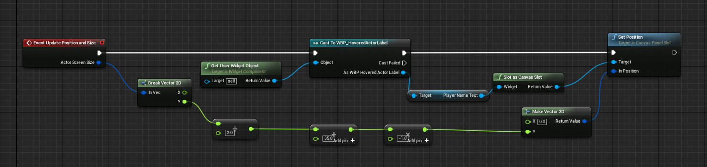

### Building Cursors

1. Create an actor deriving from `RTSBuildingCursor` (or use the `BP_RTSBuildingCursor` shipped with the plugin).
1. In your player controller, set the building cursor reference.

### Range Indicators

1. Create an actor deriving from `RTSRangeIndicator` (or use the `BP_RTSRangeIndicator` shipped with the plugin).
1. At your building cursor, set the range indicator reference.

### Production UI

1. Use `GetAvailableProducts` of a selected production actor to create buttons for your production options (e.g. whenever the player controller raises OnSelectionChanged).
1. Call `IssueProductionOrder` of your player controller whenever one of these buttons is clicked.

### Production Progress Bars

1. In your HUD, set _Always Show Production Progress Bars, Show Hover Production Progress Bars, Show Selection Production Progress Bars_ and _Show Hotkey Production Progress Bars_ as desired.
2. Create a widget for drawing the production progress bar.

_See the [Health Bars](#health-bars) section for an example._

3. Create a component deriving from `RTSProductionProgressBarWidgetComponent`, and set its _Widget Class_ to your progress bar widget.
4. Forward the `UpdateProductionProgressBar` event to your progress bar widget.
5. Forward the `UpdatePositionAndSize` event to your progress bar widget.

### Construction UI

1. Use `GetConstructibleBuildingClasses` of a selected builder to create buttons for your construction options (e.g. whenever the player controller raises `OnSelectionChanged`).
1. Call `BeginBuildingPlacement` of your player controller whenever one of these buttons is clicked.

### Construction Progress Bars

1. In your HUD, set _Always Show Construction Progress Bars, Show Hover Construction Progress Bars, Show Selection Construction Progress Bars_ and _Show Hotkey Construction Progress Bars_ as desired.
2. Create a widget for drawing the construction progress bar.

_See the [Health Bars](#health-bars) section for an example._

3. Create a component deriving from `RTSConstructionProgressBarWidgetComponent`, and set its _Widget Class_ to your progress bar widget.
4. Forward the `UpdateConstrutionProgressBar` event to your progress bar widget.
5. Forward the `UpdatePositionAndSize` event to your progress bar widget.

### Resources UI

1. Create a widget for showing your current resources.
1. Handle the `OnResourcesChanged` event raised by the `PlayerResourcesComponent` attached to your player controller to update your UI.

### Minimap

1. Add the `WBP_RTSMinimapWidget` to your UI, with a size matching your minimap volume images (e.g. 256 x 256).
1. Set the _Draw Background, Draw Units With Team Colors, Draw Vision_ and _Draw View Frustum_ flags as desired.
1. If you checked _Draw Units With Team Colors_, set the _Own Units Brush, Enemy Units Brush_ and _Neutral Units Brush_ as desired.

### Floating Combat Texts

1. In your HUD, enable _Show Floating Combat Texts_.
2. Set _Floating Combat Text Speed_ and _Fade Out Floating Combat Texts_ as desired.
3. Add a `RTSFloatingCombatTextComponent` to any actor that should be able to display texts above them.
4. Create an actor component for adding the actual floating combat texts.

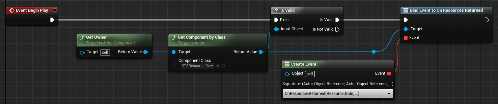
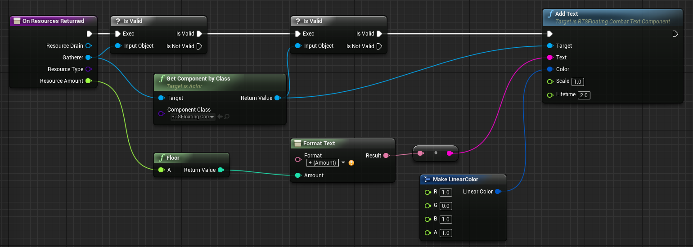

5. Add your actor component to all actors that should be able to add floating combat texts.
6. In your HUD, handle the `DrawFloatingCombatText` event.

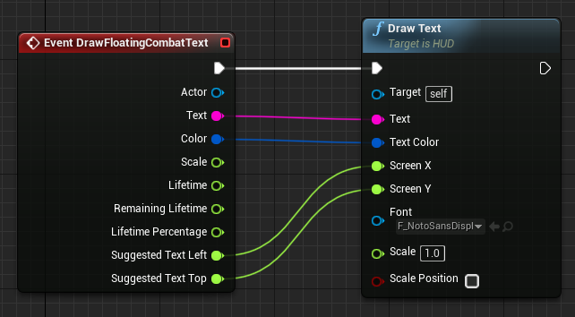
