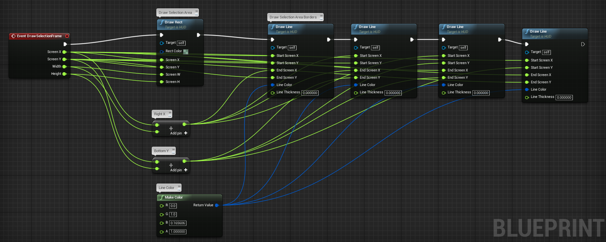
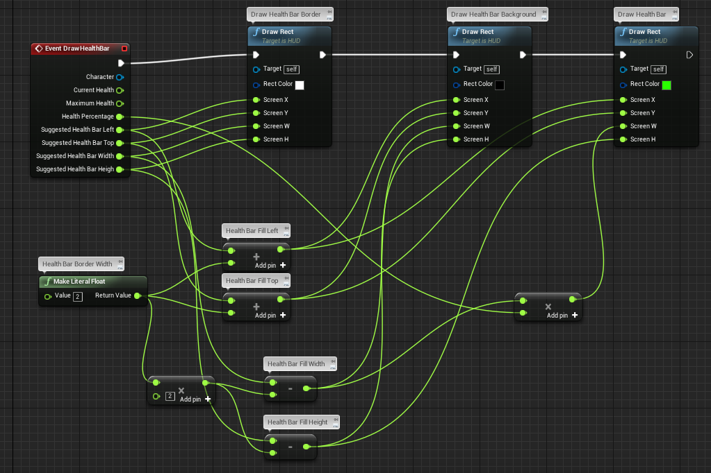
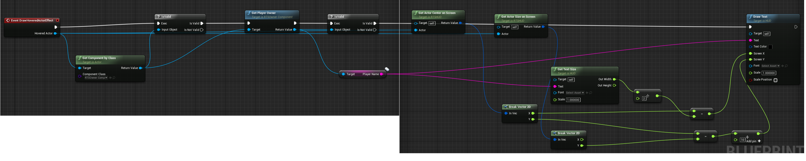

# Real-Time Strategy Plugin for Unreal Engine 4

Open-Source Real-Time Strategy Plugin for Unreal Engine 4 developed by the original creators of [Hostile Worlds](http://www.indiedb.com/games/hostile-worlds/) for Unreal Engine 3.

We really love the spirit of Unreal 4 moving to open-source, and we'd love to give something back.

Note that we're still in heavy development. Some things are already in place, such as

* Camera Movement & Bounds
* Initial Unit Placement
* Single- and Multi-Unit Selection
* Movement Orders
* Stop Orders
* Attack Orders
* Health, Damage (and Healing), Cooldown, Range
* Victory Conditions
* Projectiles
* Unit Target Acquisition
* Control Groups
* Health Bars
* Minimap
* Teams
* Constructions
* Unit Production/Tech Research
* Resource Gathering
* Fog of War

All of this is already completely working in multiplayer as well, and has been fully exposed to scripting, enabling you to update UI and play animations and sounds.

We're going to add all of this to the Unreal Marketplace for free as well soon (tm).

For a quick look, just open RTSSampleGame/Maps/RTSGameSampleMap.umap in the editor and hit Play. We recommend taking a closer look at that map as reference for your own ones as well.

## Adding The Plugin

Note that the plugin currently requires a C++ Unreal project, which in turn requires a working compiler.

1. Clone the repository.
1. Close the Unreal Editor.
1. Copy the RTSPlugin folder to Plugins folder next to your .uproject file.
1. Right-click your .uproject file and select Re-generate Visual Studio project files.
1. Build the resulting solution in Visual Studio.
1. Start the Unreal Editor.
1. Enable the plugin in Edit > Plugins > RTS.

## Usage

### Adding Units

1. Setup your animations. (If you're new to the Unreal animation system, we can readily recommend the tutorial at https://docs.unrealengine.com/latest/INT/Programming/Tutorials/FirstPersonShooter/4/index.html)

### Selecting Units

#### Enabling Selection

1. Bind the action Select (e.g. to left mouse button).
1. Bind the action AddSelection (e.g. to Left Shift).
1. Bind the action ToggleSelection (e.g. to Left Ctrl).
1. Add SelectableComponents to everything selectable.
1. At every SelectableComponent, set the Selection Circle Material (e.g. to M_RTSSelectionCircle).
1. At every SelectableComponent, set the Selected Sound as desired.
1. Listen to the OnSelectionChanged event broadcasted by the RTSPlayerController.

#### Showing Selection Frames

1. Create a new HUD deriving from RTSHUD.
1. Use the new RTSHUD in your game mode.
1. In your RTSHUD, implement the DrawSelectionFrame event as desired.

Example: Drawing selection frame as transparent rectangle with borders

#### Enabling Control Groups

1. Bind the actions SaveControlGroup0 to SaveControlGroup9 (e.g. to CTRL+0 to CTRL+9).
1. Bind the actions LoadControlGroup0 to LoadControlGroup9 (e.g. to 0 to 9).

#### Showing Selection

1. For each character, set the Decal Material of its SelectionCircleDecalComponent.

### Enabling Unit Orders

1. Bind the action IssueOrder (e.g. to the right mouse button). This will enable typical smart orders, such as moving when right-clicking ground, and attacking when right-clicking enemies.
1. Bind the action IssueStopOrder (e.g. to the S key).

### Setup Up Attacks

1. Add the RTSAttackableComponent and RTSHealthComponent to any actors that can be attacked.
1. Set the Current Health and Maximum Health properties of the RTSHealthComponent for these actors.
1. Add the RTSAttackComponent to any actors than can attack.
1. Add an attack to the RTSAttackComponent of these actors, setting its Cooldown, Damage, Range, Acquisition Radius and Chase Radius.

_Setting the Damage Type is optional. Remaining Cooldown is handled by the framework and just exposed for scripting purposes._

### Adding Projectiles

1. Create a new RTSProjectile blueprint.
1. Add a static mesh and any visual effects.
1. At the ProjectileMovement component, set its Initial Speed (e.g. to 1000).
1. For all RTSAttackComponents that should use this projectile, reference the new projectile.

### Setup Victory Conditions

1. Set the Initial Actors for your RTSGameMode. This will spawn initial units for each player at their player start.
1. Optionally, set the Defeat Condition Actor type for your RTSGameMode. This will check whether any actors of the specified type exist for a player whenever he or she loses a unit. If no actor of the specified type remains, the player is defeated. Note that it is up to you to define how defeated players should be handled, e.g. whether you've making a 1v1, FFA or team game.

### Add HUD

#### Showing Health Bars

1. In your RTSHUD, set AlwaysShowHealthBars, ShowHoverHealthBars, ShowSelectionHealthBars and ShowHotkeyHealthBars as desired.
1. If you checked ShowHotkeyHealthBars, bind the action ShowHealthBars (e.g. to the LeftAlt key).
1. In your RTSHUD, implement the DrawHealthBar event as desired.

Example: Drawing health bars as rectangles with borders

#### Showing Construction Progress Bars

1. In your RTSHUD, set AlwaysShowConstructionProgressBars, ShowHoverConstructionProgressBars, ShowSelectionConstructionProgressBars and ShowHotkeyConstructionProgressBars as desired.
1. If you checked ShowHotkeyConstructionProgressBars, bind the action ShowConstructionProgressBars (e.g. to the LeftAlt key).
1. In your RTSHUD, implement the DrawConstructionProgressBar event as desired.

#### Showing Production Progress Bars

1. In your RTSHUD, set AlwaysShowProductionProgressBars, ShowHoverProductionProgressBars, ShowSelectionProductionProgressBars and ShowHotkeyProductionProgressBars as desired.
1. If you checked ShowHotkeyProductionProgressBars, bind the action ShowProductionProgressBars (e.g. to the LeftAlt key).
1. In your RTSHUD, implement the DrawProductionProgressBar event as desired.

#### Showing Hovered Unit Effects

1. In your RTSHUD, implement the DrawHoveredActorEffect event as desired.

Example: Drawing names of unit owners

### Setup Minimap

#### Minimap Background Layer

1. Create a new Asset > Materials & Textures > Render Target (e.g. called MinimapBackgroundRenderTarget).
1. Set its Compression Settings to User Interface and Texture Group to UI.
1. Create a Material from your Render Target.
1. Set its Material Domain to User Interface and make sure the texture is connected to Final Color.

1. Set its height to a reasonable distance (e.g. Z = 2000).
1. Rotate it, making it face your map (e.g. Rotation Y = -90).
1. In the Scene Capture section, assign your render target to the Texture Target of the SceneCapture2D.
1. Disable Capture Every Frame.
1. Still in the Scene Capture section, in the hidden settings, at General Show Flags, disable everything that doesn't make sense for a minimap background (e.g. check BSP, Landscape, Static Meshes only).

#### Minimap Units Layer

1. Add a MinimapVolume at the very center of your map.
1. Set its brush size to match the extents of your playable map.
1. Create a new RTSMinimapWidget blueprint.
1. Set the minimap background image to your minimap background render target material.
1. Set the minimap background image size to a reasonable value (e.g. 256 x 256).
1. Setup brushes for own units, enemy units and neutral units (e.g. image = WhiteSquareTexture, size = 4 x 4, tint = green, red, yellow, respectively).
1. Add your RTSMinimapWidget to your UI, with a matching size (e.g. 256 x 256).
1. Set its Behaviour > Visibility to Visible if the player should be able to move the camera and give orders using the minimap.

#### Minimap Fog of War Layer

1. Setup fog of war (see below).
1. Set the FogOfWarMaterial of your RTSMinimapWidget to M_RTSFogOfWarMinimap.
1. In your player controller blueprint (or whichever owns the minimap widget), when setting up (e.g. in BeginPlay):
    1. Use the blueprint function RTSPlayerController::GetTeamInfo to get the team of the local player.
    1. Use the blueprint function GetVisionInfoForTeam to get vision info for the local player.
    1. Call SetupVisionInfo for the minimap widget.
1. In your player controller blueprint (or whichever owns the minimap widget), handle the OnVisionInfoAvailable event and call SetupVisionInfo for the minimap widget. This is required for properly setting up vision info on clients where replication may cause a different initialization order.

### Setup Building Placement

1. Create an RTSBuildingCursor, setting its valid and invalid materials (or use BP_RTSBuildingCursor).
1. In your player controller, set the building cursor reference.
1. Bind any input or UI button to the BeginBuildingPlacement function of your RTSPlayerController.
1. Bind the action ConfirmBuildingPlacement (e.g. to Left Mouse Button).
1. Bind the action CancelBuildingPlacement (e.g. to Right Mouse Button).
1. Bind the action CancelConstruction (e.g. to Escape).

### Setup Construction

1. Add the RTSBuilderComponent to any actors you want to be able to construct buildings.
1. Set the Constructible Building Types for these builders.
1. Set the Enter Construction Site if you want the builder to be unavailable while building (similar to Orcs in WarCraft).

### Setup Unit Production

1. Add the RTSProductionComponent to any actors you want to be able to produce units or research technology.
1. Add everything you want to produce or research to the Available Products for these factories.
1. Set the Queue Count, specifying how many products can be produced in parallel.
1. Set the Capacity Per Queue, specifying how many products can be produced one after another.
1. Add the RTSProductionCostComponent to everything you want to be produced.
1. Set the Production Time for these products.
1. Set the Resources to any resources required for production.
1. Set the Production Cost Type to to Pay Immediately if all costs should be paid in full when starting production, or to Pay Over Time for continuously paying costs (similar to Command & Conquer).
1. Set the Refund Factor to the factor to multiply refunded resources with after cancelation.
1. Bind the action CancelProduction (e.g. to Escape).
1. In your ingame UI, bind the actions of any of your buttons to call IssueProductionOrder on your player controller.

_Note that, technically, producing units does not differ from researching technology. You can create actor blueprints without physical representation for each technology to research, and add them as products. Then, you can check whether any player owns an actor of that technology for checking a tech tree._

### Add Resource Gathering

1. Create an RTSResourceType blueprint for each resource in your game.
1. Add the resource types to your player controller to enable players to keep resources in stock. Listen for the OnResourcesChanged event to update your UI.
1. Create a unit (see above) and add an RTSResourceSourceComponent for each type of resource node in your game (e.g. gold mine, tree).
    1. Set the resource type and maximum and current resources of the source.
    1. Set the gathering factor for increaing the yield of any gatherers (e.g. golden minerals).
    1. Add an RTSContainerComponent, check Gatherer Must Enter and set the Gatherer Capacity if you want gatherers to enter the resource source (e.g. Refinery in StarCraft).
1. Create a unit (see above) and add an RTSResourceDrainComponent for each type of building gatherers may return resources to.
    1. Set the resource types to all resources accepted by the drain.
1. Create an RTSGathererComponent to any unit that should be able to gather resources.
    1. Add any resource type the gatherer should be able to gather to Gathered Resources.
        1. Gathering works similar to attacks, with "damage" and "cooldown". Set Amount Per Gathering to the value to add to the gatherers inventory each time the cooldown is finished.
        1. Set the Cooldown to the time between two gatherings.
        1. Set the Capacity to the amount of resources the gatherer can carry before returning to a resource drain.
        1. Check Needs Return To Drain if the gatherer needs to move to another actor for returning resources (e.g. Age of Empires). Uncheck if they should return all gathered resources immediately when hitting the capacity limit (e.g. Undead in WarCraft).
        1. Set Range as desired.
    1. Add all Resource Source Actor Classes the gatherer may gather from (e.g. Undead in Warcraft need Haunted Gold Mine).
    1. Set the Resource Sweep Radius to the radius in which the gatherer should look for similar resources if their current source is depleted.

### Setup Fog of War

1. Add the RTSVision component to your units and set their Sight Radius (e.g. 1000).
1. Add an RTSVisionVolume to your map, encompassing the whole valid visible map area (e.g. 4096x4096).
1. Set the Size Per Tile of the vision volume (e.g. 16).
1. Add a PostProcessVolume to your map, encompassing the whole valid camera area.
1. Add an RTSFogOfWarActor to your map.
1. Set the Fog Of War Material of the actor (e.g. to the M_RTSFogOfWar material shipped with the plugin).
1. Set the Fog Of War Volume reference to the post process volume created before.

## Bugs & Feature Requests

We are sorry that you've experienced issues or are missing a feature! After verifying that you are using the latest version and having checked whether a [similar issue](https://github.com/npruehs/ue4-rts/issues) has already been reported, feel free to [open a new issue](https://github.com/npruehs/ue4-rts/issues/new). In order to help us resolving your problem as fast as possible, please include the following details in your report:

* Steps to reproduce
* What happened?
* What did you expect to happen?

After being able to reproduce the issue, we'll look into fixing it immediately.

## Contributing

You'd like to help make this plugin even more awesome? Seems like today's our lucky day! In order to maintain stability of the tool and its code base, please adhere to the following steps, and we'll be pleased to include your additions in our next release.

Note that this plugin is distributed under the [MIT License](https://github.com/npruehs/ue4-rts/blob/develop/LICENSE). So will be your code.

### Step 1: Choose what to do

If you've got no idea how to help, head over to our [issue tracker](https://github.com/npruehs/ue4-rts/issues) and see what you'd like to do most. You can basically pick anything you want to, as long as it's not already assigned to anyone.

If you know exactly what you're missing, [open a new issue](https://github.com/npruehs/ue4-rts/issues/new) to begin a short discussion about your idea and how it fits the project. If we all agree, you're good to go!

### Step 2: Fork the project and check out the code

Real-Time Strategy Plugin for Unreal Engine 4 is developed using the [GitFlow branching model](http://nvie.com/posts/a-successful-git-branching-model/). In order to contribute, you should check out the latest develop branch, and create a new feature or hotfix branch to be merged back.

### Step 3: Implement your feature or bugfix

Real-Time Strategy Plugin for Unreal Engine 4 is based on [Unreal Engine 4.16.1](https://www.unrealengine.com/).

### Step 4: Open a pull request

Finally, [open a pull request](https://help.github.com/articles/creating-a-pull-request/) so we can review your changes together, and finally integrate it into the next release.

## License

Real-Time Strategy Plugin for Unreal Engine 4 is dual-licensed:

* everything beneath Source\RTS\Content\StarterContent is governed by the [Unreal® Engine End User License Agreement](https://www.unrealengine.com/eula) 
* everything else is released under the [MIT License](https://github.com/npruehs/ue4-rts/blob/develop/LICENSE)
